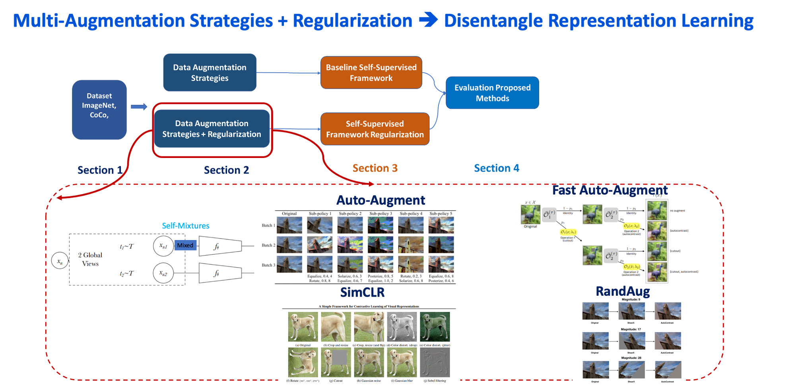

# Multi-Augmentation Strategies Disentangle represenation learning Self-Supervised

## First Checkout Guideline for Contribution

Awesome! Thank You for being a part this project > > 
Before you start to contribute for this repository, please quick go through [Guidelines](contribution_guideline.md).

<!---
## List of Literature Overviews For Deep Understanding Project Method. 

Supervised + Self-Supervised Literatures > > 
  Please!! go through all these Important papers [Papers](data_augmentation_regularization_literature_overviews.md).

## Our Project Proposal Methods

### 1. **SECTION 2  Multi-Augment Strategies + Regularization** 

- Implementation **Two Views** Multi-Augment --> Multi-Augment + Regularization

+ Multi-Augmentation Strategy (SimCLR+ BYOL, RandAug [version 14 & 21 Transformation], Auto-Augmentation V0 Policy[Check out paper detail]

Detail How to Implement 

--->
