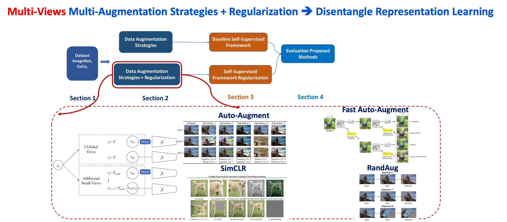

# Multi-Augmentation Strategies Disentangle represenation learning Self-Supervised

## First Checkout Guideline for Contribution

Awesome! Thank You for being a part this project > > 
Before you start to contribute for this repository, please quick go through [Guidelines](contribution_guideline.md).

## List of Literature Overviews For Deep Understanding Project Method. 

Supervised + Self-Supervised Literatures > > 
Please!! go through all these Important papers [Papers](data_augmentation_regularization_literature_overviews.md).

## Our Project Proposal Methods

### 1. **SECTION 2  Multi-Augment Strategies + Regularization** 

- Implementation **Two Views** Multi-Augment --> Multi-Augment + Regularization

+ Multi-Augmentation Strategy (SimCLR+ BYOL, RandAug [version 14 & 21 Transformation], Auto-Augmentation V0 Policy[Check out paper detail]

Detail How to Implement 

**/Augmentation_strategies/Simclr_augment_random/**

**/Augmentation_strategies/Auto_Augment/**

**/Augmentation_strategies/Rand_Augment/**

**Fast_Auto_Augment Under Development**

+ Regularization (Mixup + CutMix) + Future adding Manifold Mixup
 
 Details How to Implement CutMix & Mixup can find as following directory

**/Regularization_Technique/Mixup/**

**/Regularization_Technique/CutMix/**

**Manifold Mixup Under Development**

- Implementation **Multi- Views** Multi-Augment --> Multi-Augment + Regularization
The Flow pipeline of Multi-Views is Similar to Two-Views --> Modify for Multiple Croping and Multi-Resolution Output 

 

### 2. **SECTION Two different contrastive Frameworks Multi-Augment Strategies + Regularization** 

+ Conventional Contrastive Framework implementation

**Positive Pair and Negative Pairs**

**Positive Pair only**

Detail Implementation can be found 

**self_supervised_learning_frameworks/contrastive_framework/**

**self_supervised_learning_frameworks/Non-contrastive_framework/**

+ Conventional Contrastive Framework implementation with Regularization 

**Mixup+Contrastive Framework**

Detail Implementation can be found 

**self_supervised_learning_frameworks/mix_contrastive_framework/**

**CutMix+Contrastive Framework is Under development**

